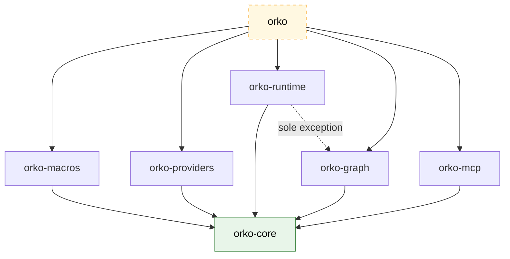

# Orko

> **Agent orchestration toolkit for Rust** — efficient, durable, streaming-first agent orchestration

[](LICENSE)
[](Cargo.toml)
[](#development-status)

```rust
use orko::{create_agent, Provider, Result};

async fn demo(p: impl Provider) -> Result<()> {
    let agent = create_agent(p)
        .with_system_prompt("You are an agent orchestrated with Orko.")
        .build();
    let reply = agent.invoke("Hello!").await?;
    println!("{reply}");
    Ok(())
}
```

## Development status

| Crate                                     | Purpose                                                                            |     Status      | Notes                                                                      |
| ----------------------------------------- | ---------------------------------------------------------------------------------- | :-------------: | -------------------------------------------------------------------------- |
| [`orko-core`](crates/orko-core)           | Core traits & types — `Provider`, `Agent`, `Tool`, `ModelRouter`, streaming chunks |    **alpha**    | API-frozen · 4 unit tests + 1 doctest passing · `clippy -D warnings` clean |
| [`orko-macros`](crates/orko-macros)       | Proc macros (ergonomic tool definitions)                                           |   **review**    | `macro@tool` to turn `#[tool]` decorated functions into `Tool`             |
| [`orko-providers`](crates/orko-providers) | Provider implementations (OpenAI-compatible HTTP + SSE, local inference)           |  🩻 Scaffolded  | Empty stub                                                                 |
| [`orko-graph`](crates/orko-graph)         | Graph-based multi-agent workflows                                                  |  🩻 Scaffolded  | Empty stub                                                                 |
| [`orko-runtime`](crates/orko-runtime)     | Tokio runtime integration & task spawning                                          |  🩻 Scaffolded  | Empty stub — the _only_ crate allowed to touch tokio                       |
| [`orko-mcp`](crates/orko-mcp)             | Model Context Protocol integration                                                 |  🩻 Scaffolded  | Empty stub                                                                 |
| `orko` (facade)                           | Single-dependency entry point re-exporting the workspace                           | **development** | Created last, once the pieces exist                                        |

### Providers status

Every provider is tracked as an issue under the
[`crate: providers`](https://github.com/orko-rs/orko/labels/crate%3A%20providers) label.
The OpenAI-compatible engine ([#3](https://github.com/orko-rs/orko/issues/3)) is the
foundation — everything marked _preset_ is a thin configuration over it, while _codec_
rows implement a new wire format sharing the same transport.

| Provider   | Kind                     | Env key              |                  Tracking issue                  |   Status    |
| ---------- | ------------------------ | -------------------- | :----------------------------------------------: | :---------: |
| OpenAI     | engine + preset          | `OPENAI_API_KEY`     |  [#3](https://github.com/orko-rs/orko/issues/3)  | **planned** |
| Anthropic  | native codec             | `ANTHROPIC_API_KEY`  |  [#6](https://github.com/orko-rs/orko/issues/6)  | **planned** |
| Google     | preset (compat endpoint) | `GEMINI_API_KEY`     |  [#4](https://github.com/orko-rs/orko/issues/4)  | **planned** |
| DeepSeek   | preset                   | `DEEPSEEK_API_KEY`   |  [#5](https://github.com/orko-rs/orko/issues/5)  | **planned** |
| Groq       | preset                   | `GROQ_API_KEY`       |  [#7](https://github.com/orko-rs/orko/issues/7)  | **planned** |
| Together   | preset                   | `TOGETHER_API_KEY`   |  [#8](https://github.com/orko-rs/orko/issues/8)  | **planned** |
| OpenRouter | preset                   | `OPENROUTER_API_KEY` |  [#9](https://github.com/orko-rs/orko/issues/9)  | **planned** |
| Moonshot   | preset                   | `MOONSHOT_API_KEY`   | [#10](https://github.com/orko-rs/orko/issues/10) | **planned** |
| Qwen       | preset                   | `DASHSCOPE_API_KEY`  | [#11](https://github.com/orko-rs/orko/issues/11) | **planned** |
| Ollama     | preset (local, no auth)  | —                    | [#12](https://github.com/orko-rs/orko/issues/12) | **planned** |
| vLLM       | preset (local)           | `VLLM_API_KEY`¹      | [#13](https://github.com/orko-rs/orko/issues/13) | **planned** |
| llama.cpp  | preset (local)           | `LLAMACPP_API_KEY`¹  | [#14](https://github.com/orko-rs/orko/issues/14) | **planned** |
| Candle     | in-process (no HTTP)     | `HF_TOKEN`¹          | [#15](https://github.com/orko-rs/orko/issues/15) | **planned** |

¹ optional — only sent when the server enforces auth (Candle: only for gated Hub repos).

<!--### What works today (`orko-core`)

| Area      | Delivered                                                                                                                       |
| --------- | ------------------------------------------------------------------------------------------------------------------------------- |
| Messages  | `Role` / `Message` / `Prompt` with ergonomic `From` conversions; wire format test-locked to `{"role":"user","content":"hello"}` |
| Providers | Generic-first `Provider` trait + object-safe `DynProvider` / `BoxProvider` twin, so both static and dynamic dispatch work       |
| Streaming | `CompletionStream` of `CompletionChunk` deltas — content, reasoning, refusals, tool-call fragments, finish reason, usage        |
| Tools     | Object-safe `Tool` trait + `ToolSpec` (JSON-Schema parameters)                                                                  |
| Agents    | `create_agent(provider)` builder — system prompt, model, tools; `invoke` / `invoke_stream`                                      |
| Routing   | `ModelRouter` trait + `StaticRouter`                                                                                            |

Deliberately deferred (tracked, not forgotten): `tool_choice` option,
tool-call/tool-result message variants, and the agent tool-execution loop.-->

## Architecture



Arrows mean "depends on": everything points down at `orko-core`, the facade (orko)
points at everything, and the one dotted edge is the single allowed extra
dependency (`orko-runtime` → `orko-graph`).

The rules that keep it honest:

1. **Dependencies flow down** — every crate depends only on `orko-core`
   (sole exception: `orko-runtime` may also depend on `orko-graph`).
2. **No tokio in public APIs** — public traits use `std::future::Future` and
   `futures::Stream` only; tokio lives exclusively inside `orko-runtime`.
3. **`orko-core` stays lean** — exactly four dependencies (`serde`,
   `serde_json`, `thiserror`, `futures`), no HTTP, no runtime, `#![forbid(unsafe_code)]`.

## Getting started

```sh
git clone https://github.com/orko-rs/orko
cd orko
cargo test -p orko-core
cargo clippy -p orko-core --all-targets -- -D warnings
```

## License

Licensed under the [Apache License, Version 2.0](LICENSE).
